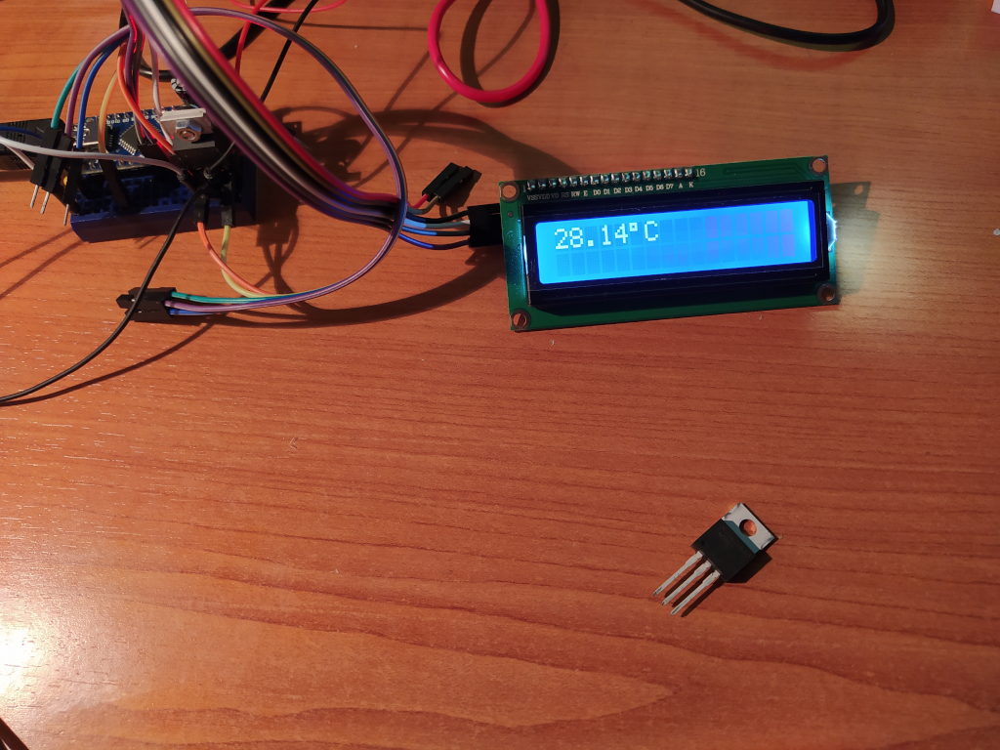

# arduino-misc-projects
This repository is for short projects, mostly to interface with a sensor or a device

## Projects-LM35 Temperature sensor

[Blog post](https://gajdicookbook.wordpress.com/2021/04/26/arduino-lm35-temperature-sensor-1/)

* **lm35:** Read the ADC value from pin A0, and print the temperature to Serial.
* **lm35_lcd:** Read the ADC value from pin A0, and print the temperature on an LCD and to Serial.

